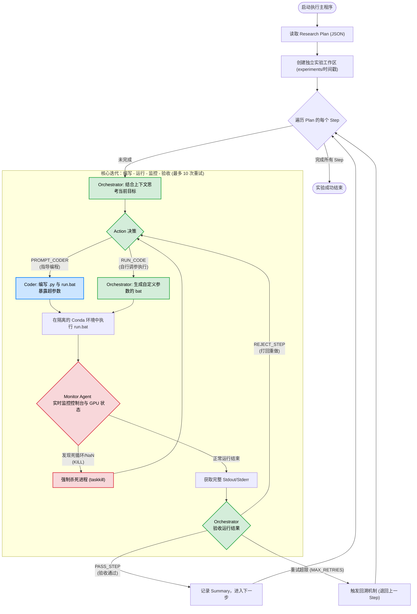
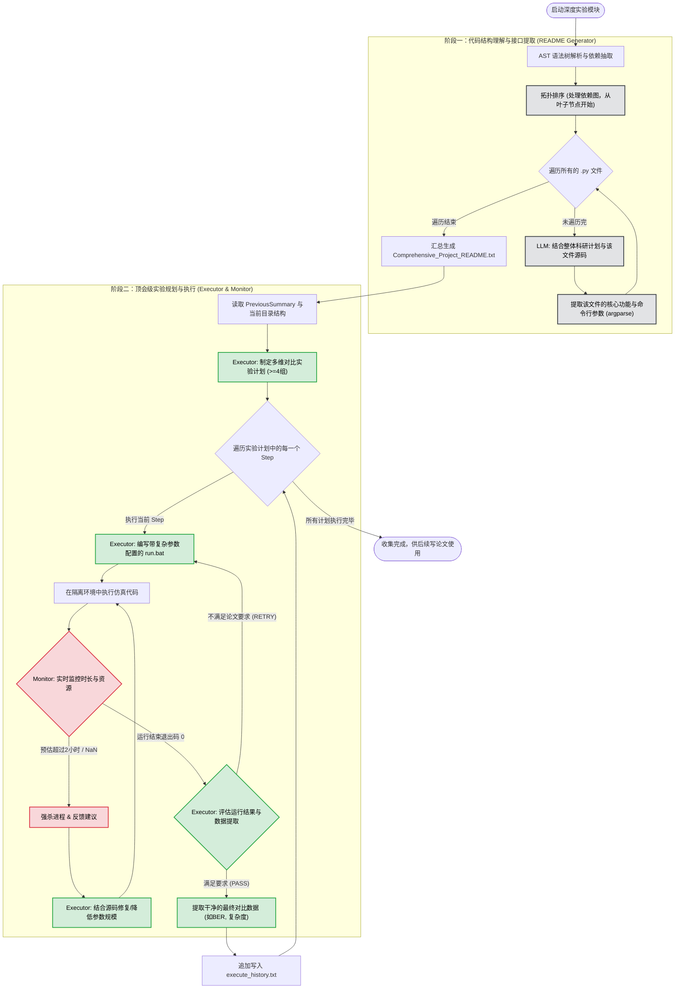

# Aether: Towards fully automated communication research

---

# 🧠 Aether: IdeaGenerator 模块详解

## 📖 模块简介
**Aether** 是一个专注于通信领域的虚拟 AI 科学家。`IdeaGenerator` 是 Aether 的“大脑”与“灵感引擎”，负责从零开始构思具有高度创新性、跨学科且具备落地可行性的科研 Idea，并对其进行严苛的学术审查。

该模块采用 **“学生-老师” (Student-Teacher) 双智能体架构**：
1. **Student Agent (Idea Generator)**：扮演极具创造力的 AI 科学家，负责提出假设、检索文献、迭代打磨科研 Idea。
2. **Teacher Agent (Novelty Checker)**：扮演顶会资深审稿人 (Area Chair)，负责通过检索前沿文献对生成的 Idea 进行查重、评估与打分。

---

## ⚙️ 核心工作流程图

以下是 `IdeaGenerator` 模块的完整执行逻辑流程图：


---

## 🛠️ 详细实现解析

### 1. 外部知识库接入 (OpenAlex API)
为了确保 AI 生成的 Idea 具有时代前沿性且不与现有研究冲突，模块实现了 `search_for_papers` 函数，深度集成了学术数据库 OpenAlex：
* **摘要解析**：智能解析 OpenAlex 返回的 `abstract_inverted_index`（倒排索引），将其还原为可读的摘要文本。
* **容错与重试机制**：使用 `@backoff` 装饰器，在遭遇 HTTP 请求限制或网络波动时，采用指数退避（Exponential Backoff）策略自动重试，保证长期运行的稳定性。
* **数据瘦身**：提取标题、作者、发表平台、年份、引用量和摘要，截断过长摘要，防止 LLM 上下文超载。

### 2. Phase 1: 学生智能体 (Idea Generator)
* **角色设定**：富有雄心的通信领域学者。被限制不能提出“天马行空、无法落地”（如强行结合量子计算、脑机接口，语义通信）的伪需求，必须聚焦具体通信场景（信道衰落、硬件损伤等）。
* **迭代机制 (Self-Refinement)**：
  * **第一轮**：接收粗略主题 (`theme_idea_gen.txt`)，进行初步思考并输出文献搜索词。
  * **后续轮次**：吸收上一轮的文献搜索结果，修改已被前人研究过的设想，提出新 Idea。
  * **提前终止**：当模型在 `Thoughts` 字段中输出 `"I'm done"` 时，认为 Idea 已足够完善，主动结束迭代，节省 Token。
* **并发执行**：通过 `ThreadPoolExecutor` 并发启动多个 Student，极大地提高了灵感发散的广度和生成效率。

### 3. Phase 2: 老师智能体 (Novelty Check)
* **角色设定**：极其严格的顶级学术会议 Area Chair。被告知 Idea 由 AI 生成，要求其必须秉持怀疑态度进行审查。
* **动态多轮查重**：
  * Teacher 不会被强制要求一次性给出评分。它可以通过输出 `"Decision": "Pending"` 并附带 `SearchQueries`，不断要求系统去 OpenAlex 查阅文献。
  * 只有当收集了足够证据，确认 Idea 的创新性和仿真可行性后，才会输出 `"Decision": "Finished"`，并给出 `Score` (1-10分) 和详细评价。

### 4. 稳健的 JSON 结构化输出
为保证代码解析的稳定性，通过提示词（Prompt）严格要求 LLM 输出特定格式的 JSON，配合 `LLMAgent.extract_json_between_markers` 实现精准的数据提取。
Student 提取结构：`Thoughts` -> `SearchQueries` -> `Ideas[Name, Title, Background, Hypothesis, Methodology]`。
Teacher 提取结构：`Thoughts` -> `SearchQueries` -> `Decision` -> `Score`。

---

# 📐 Aether: Research Planner 模块详解

## 📖 模块简介
**Research Planner** 是 Aether 的“架构师”与“施工指导”。它的核心职责是将 `IdeaGenerator` 提出的抽象、高阶的科研想法（Idea），转化为**极其详尽、循序渐进、数学严谨且包含具体基线（Baselines）的可执行代码编写与仿真计划**。

由于后续的仿真代码将由能力受限的代码生成 AI 来完成，因此该模块生成的 Plan 必须达到“手把手”的颗粒度，严禁跳跃性思维。

该模块同样采用 **“学生-导师” (Student-Teacher) 协同对抗架构**：
1. **Student Planner (研究员)**：负责拆解 Idea，建立数学系统模型，并严格按照“传统基线 -> AI基线 -> 创新方案分步叠加”的逻辑编写执行计划。
2. **Teacher Planner (资深教授)**：扮演极其严苛的导师，专门挑刺。审查步骤跨度是否过大、数学表达是否清晰、验收标准（expected outcome）是否可量化。

---

## ⚙️ 核心工作流程图

以下是 `Research Planner` 模块的并发执行逻辑图：


---

## 🛠️ 详细实现解析

### 1. 极其严格的 4 模块标准化输出
为了保证后续代码执行者不会“迷失方向”，Student Agent 被 Prompt 严格限制，必须按照以下 4 个模块输出计划：
*   **模块 1：System Model (系统模型)**：必须使用具体的数学语言定义变量（如信道矩阵、发送信号、目标优化函数等）。变量来源必须清晰。
*   **模块 2：Baselines (基线方法)**：强制要求先实现传统通信方法（如 ZF, MMSE），再实现基础 AI 方法作为对比参照物，确保科研的严谨性。
*   **模块 3：Innovative Scheme (创新方案拆解)**：强制要求将 AI 创新部分**至少拆分成 3 个递进的微小步骤**。
*   **模块 4：Comparison & Outcomes (对比与预期)**：明确评估指标。每个步骤的 `expected_outcome` 必须是可量化衡量的。

### 2. 师生对抗机制 (Actor-Critic 思想)
*   **迭代打磨**：Student 初次提交计划后，Teacher 会根据“步骤是否太宽泛？”、“是否有数学描述？”等核心准则进行苛刻打分。
*   **反馈修正**：如果 Teacher 判定为 `Refine`，会将详细的批评意见（`Thoughts`）打回给 Student。Student 必须在下一轮上下文中吸收这些批评，细化颗粒度。
*   **兜底机制**：如果达到 `max_iters` 仍未拿到 `Pass`，系统会自动保留最后一版的计划，防止死循环。

### 3. 多路并行探索 ($K$-Agents 并发)
通信仿真往往有多种实现路径。该脚本引入了 `--k_agents` 机制：
*   对于**每一个**输入的 Idea，系统会并发启动 $K$ 组完全独立的 `Student-Teacher` 组合。
*   这意味着同一个 Idea 会得到 $K$ 种不同的落地计划（Plan），极大增加了后续代码生成成功的容错率。最后会将这 $K$ 份计划统一汇总到一个独立的 JSON 文件中（如 `idea_1_plans.json`）。
---


# 💻 Aether: Code Generator & Execution 模块详解

## 📖 模块简介
**Code Generator & Execution** 是 Aether 系统的“双手”与“实验台”。它的核心任务是接收 `Research Planner` 生成的细粒度研究计划，在真实的本地环境（Conda）中编写 Python 仿真代码、执行脚本，并根据运行结果不断进行 Debug 和优化，直至完成科研设想的初步落地。

该模块突破了传统单点代码生成的局限，采用创新的 **“管家-码农-监工” (Orchestrator-Coder-Monitor) 三智能体协同架构**：
1. **Orchestrator Agent (项目管家)**：负责统筹推进。它不写具体代码，而是向 Coder 下达指令、动态修改运行参数、验收运行结果，并决定是进入下一步还是打回重做。
2. **Coding Agent (AI程序员)**：负责纯粹的工程实现。根据管家指令编写带有高度可调参数（`argparse`）的 Python 代码及运行批处理脚本（`.bat`）。
3. **Monitor Agent (实时监控助手)**：作为底层“安全阀”，实时读取控制台和硬件资源状态，精准狙击死循环、模型发散（NaN）或长时间卡死，防止资源浪费。

---

## ⚙️ 核心工作流程图

以下是代码生成与执行模块的完整执行逻辑图：



---

## 🛠️ 详细实现解析

### 1. 实时硬件与进程监控机制 (Monitor Agent)
传统大模型在执行代码时，如果遇到 `while True` 或模型训练崩溃卡死，往往会导致整个流程挂起。本模块引入了自动监控与打断机制：
* **异步非阻塞读取**：通过后台线程 (`reader_thread`) 和 `queue` 实时收集 stdout/stderr，不影响主程序的响应。
* **硬件状态感知**：运行时通过 `subprocess` 调用 `nvidia-smi` 和 `wmic`，获取真实的 GPU 显存和物理内存状态，连同最近的控制台输出一起喂给 Monitor Agent。
* **智能熔断 (Kill Switch)**：每隔 200 秒，Monitor 会判断代码是否处于“无意义耗时”状态。若判定异常，直接调用 Windows 底层 `taskkill /F /T` 强杀进程树，并将报错信息反馈给 Orchestrator 进行修复。

### 2. 极致的参数化要求与免重写测试
* **命令行暴露 (argparse)**：Prompt 严格要求 Coder 必须通过 `argparser` 将仿真环境的所有超参数（如信噪比、Epoch、学习率等）暴露到命令行。
* **Orchestrator 越权操作**：如果 Orchestrator 认为代码逻辑无误，仅仅是参数设置不好导致结果不达预期。它可以直接输出 `RUN_CODE` 指令，自己重写 `run.bat` (如 `python main.py --lr 0.05`)，**绕过 Coder 直接重新运行测试**，极大地节省了 Token 和代码重写时间。

### 3. 禁止文件 I/O 传参 (强迫模块化)
* **设计巧思**：Prompt 中包含一条严格铁律：“绝对不允许将中间结果保存到文件中再在后续读取”。这强迫 Coder 必须将代码写成规范的函数或类，通过 `import` 的方式在后续步骤中调用之前的方法。这保证了代码的高内聚、低耦合，避免了工作区充满垃圾 `.npy` 或 `.csv` 文件。

### 4. 容错与回溯机制 (Backtracking)
科研代码极少能一次跑通。
* **最大重试限制**：如果在一个 Step 中，Orchestrator 频繁打回重做或程序连续崩溃达到 `MAX_RETRIES` (默认10次)，系统判定“此路不通”。
* **动态回退**：系统会自动将进度 `step_idx -= 1`，清除当前步的冗余上下文，退回到上一个成功的步骤重新开始，模拟真实科研中“退一步海阔天空”的排错思路。

### 5. 标准化文件提取
利用正则表达式精准拦截 Coder 输出中的 Markdown 格式块（如 `### File: main.py\n ```python ... ``` `），自动生成本地文件。对于 `readme.md`，还会智能地进行追加拼接，保留完整的实验文档。

### 6. 精准的上下文压缩与管理策略 (Context Management)
在长时间、多步骤的代码生成与执行过程中，LLM 的上下文窗口极易被冗长的代码和报错信息撑爆。为了保证推理的高效与准确，系统对三个 Agent 采取了截然不同且极其精细的上下文管理策略：

*   **Orchestrator Agent (项目管家) —— 动态摘要与状态快照**
    *   **策略**：**每次进入新的 Step，强行清空历史对话 (`clear_history()`)。**
    *   **构建上下文**：不依赖于原生的多轮对话记忆，而是在每次调用前，重新为其拼装一个高度浓缩的“状态快照” (State Snapshot)。
    *   **快照内容**：
        1.  **全局背景**：Idea 的核心背景与方法论。
        2.  **历史成果 (Past Summaries)**：之前所有成功步骤的 `Summary` 集合（由 Orchestrator 自己在上一步 `PASS_STEP` 时精炼生成），实现了信息的极致压缩。
        3.  **当前战场 (Workspace State)**：当前工作目录下所有 `.py` 和 `.md` 文件的完整最新代码内容。
        4.  **当前任务**：当前 Step 的具体目标与验收标准。
    *   **优势**：管家永远拥有“上帝视角”和最新代码，同时避免了被失败重试过程中的大量垃圾对话干扰判断。

*   **Coding Agent (AI 程序员) —— 无状态、指令驱动**
    *   **策略**：**每次收到编写代码的请求时，强行清空历史对话 (`clear_history()`)。**
    *   **构建上下文**：Coder 完全是一个“无状态的打工人”。它的上下文仅包含三个核心要素：
        1.  **管家指令**：Orchestrator 在上一轮生成的具体的 `Coder_Prompt`（例如报错信息、修改意见、新增功能要求）。
        2.  **当前代码库**：工作目录下所有代码文件的最新状态。
        3.  **环境情报**：当前虚拟环境前 1000 字符的 `pip list` 列表（防止重复安装依赖导致超时）。
    *   **优势**：强制 Coder 每次都基于最新的真实文件状态和明确指令进行全量代码输出，杜绝了 LLM 因为“幻觉”修改了不存在的变量，或生成“假设性”的代码片段。

*   **Monitor Agent (实时监控助手) —— 滑动窗口与瞬时记忆**
    *   **策略**：**不保留任何历史对话，纯粹的单轮响应。**
    *   **构建上下文**：采用“滑动窗口”截取法。当触发监控时，系统仅提取控制台输出的**最后 150 行** (`recent_output`) 以及**实时的硬件状态**（显存/内存使用率）。
    *   **优势**：保证了监控的极速响应与超低 Token 消耗。Monitor 只需要通过瞬时的尾部输出判断程序是否陷入了死循环或正在疯狂抛出重复的异常，而不需要知道程序的完整运行历史。

---

# 📊 Aether: Deep Experiment & Data Collection 模块详解

## 📖 模块简介
如果说前一个模块是为了“让代码能跑通”，那么 **Deep Experiment & Data Collection** 模块则是为了 **“生成足够的数据，来写成论文”**。
初步生成的代码往往只包含了基础的验证（例如极少的 Epoch、单一点的 SNR），其产生的数据量和对比维度远不足以支撑一篇高质量的学术论文。

该模块接管初步跑通的仿真代码工作区，**首先通过 AST (抽象语法树) 解析代码依赖并生成详尽的接口文档，随后化身为资深科研人员，自主设计多组、多维度的严谨对比实验计划，最后将实验计划具体化为bat批处理脚本，逐项执行，并交由上层agent验收。** 智能体通过不断修改输入参数（不修改底层 Python 代码），自动化地调用批处理脚本进行大规模数据收集，并在执行后智能提取出可直接用于论文绘制图表的核心数据。

---

## ⚙️ 核心工作流程图

本模块的执行分为“代码理解与文档生成”和“深度实验与数据提取”两个连续的阶段：



---

## 🛠️ 详细实现解析

### 1. 逆向工程与 AST 依赖解析 (阶段一)
如果直接把当前仓库中的所有代码扔给AI，让其自己看如何运行，会引起上下文爆炸。因此，我们首先通过智能体提取每个代码的接口和功能摘要信息（与前面的实验计划形成对应），让后面的agent能够得知如何运行代码的同时，上下文不会被撑爆。本模块通过 Python 内置的 `ast` 库遍历所有 `.py` 文件：
*   **精准提取依赖**：拦截 `import X` 和 `from X import Y`，构建本地文件依赖有向图。
*   **拓扑排序处理**：确保 AI 在理解代码时，**“由底向上”**（从不依赖任何模块的基础文件开始，一直到顶层的 `main.py`）进行理解。
*   **强制接口暴露**：强迫 LLM 分析出每个 Python 文件的命令行调用参数及其物理意义，这为后续 Executor 通过 `.bat` 动态调参奠定了坚实基础。

### 2. 严苛的论文级实验规划 
Executor 并非盲目运行代码，而是被赋予了明确的**“唯论文导向”**视角：
*   **只调参，不改码**：系统限制 Executor **绝对不能修改原本的 Python 代码**，只能通过命令行参数（如调整网络层数、特征维度、SNR 范围）来控制实验。
*   **多维对比要求**：强制要求制定至少 4 种对比计划（包含性能与复杂度），必须探讨特定场景，且要求足够密集的采样点支撑高质量图表。

### 3. 时间感知与资源监控熔断 
在此阶段，由于涉及海量数据的训练与测试，最容易出现“跑几天几夜跑不完”的情况。
*   Monitor Agent 的 Prompt 被特别升级：不仅监控报错和死循环，还要求其**根据前 150 行输出的日志进度，预估该程序是否会执行超过 2 小时**。
*   一旦预估超时，Monitor 会果断下达 `KILL` 指令，并总结当前显存使用率反馈给 Executor，迫使 Executor 在下一轮生成 `run.bat` 时调小 `batch_size` 或适度降低规模。

### 4. 自动化数据清洗与提取
每次运行结束后，控制台日志往往包含几千行的进度条和 Loss 打印。Executor 会扮演数据分析师，从这堆“沙子”中“淘金”：过滤掉中间过程，只提取最终的 BER、SNR、运行耗时等**可以直接用于论文画图的数据列表**，并以 JSON 格式结构化保存到 `execute_history.txt` 中。

---

## 🧠 三大 Agent 上下文管理策略详解

由于本模块涉及大量的源码阅读和海量日志分析，极其容易导致 Token 溢出。系统采用了极度克制且定制化的上下文策略：

### 1. Readme Generator Agent (文档生成器) —— 单发无记忆模式
*   **策略**：每次分析一个新文件前，执行 `clear_history()`。
*   **构建上下文**：上下文中只包含三项核心信息：全局的科研计划 (Plan)、前期执行概述 (Overview)、以及**当前正在处理的单一 Python 文件的全部源码**。
*   **优势**：避免了在处理底层模块时被顶层模块的代码干扰。借助之前的拓扑排序，它能以前后一致的逻辑完美抽取每份文件的命令行参数，而不消耗多余 Token。

### 2. Executor Agent (实验执行员) —— 随用随清、外置长期记忆
*   **策略**：无论是在制定实验计划、编写 `.bat`、修复报错，还是提取数据环节，**每一次网络请求前必然执行 `clear_history()`**。它没有任何原生的多轮对话记忆。
*   **构建上下文 (外置记忆体)**：
    *   Executor 的“记忆”被物理固化在了外部文本文件 `execute_history.txt` 中。
    *   当它需要编写下一步的 `.bat` 时，它的上下文会由：**当前单步指令 + PreviousSummary (全局背景) + execute_history (之前所有成功提取的实验数据)** 拼接而成。
    *   当脚本报错时，它的上下文会替换为：**报错日志 + 该脚本调用的特定几个 .py 文件的源码**（仅按需读取，绝不把整个项目源码塞进去）。
*   **优势**：实现了极低成本的长上下文推理。Executor 不会被前几次试错失败的垃圾对话误导，始终基于最干净、已确定的“知识库”进行下一步决策。

### 3. Monitor Agent (监控器) —— 瞬时切片与预估
*   **策略**：完全无状态，定时触发。
*   **构建上下文**：仅包含截取的**最后 150 行标准输出 (stdout)** 以及**实时的 `nvidia-smi` 和物理内存信息**。
*   **优势**：极低的资源消耗。由于被注入了“预估整体执行时间是否超过 2 小时”的特殊系统提示词，Monitor 可以仅凭这 150 行打印出的如 `Epoch 1/100, ETA: 3000s` 的信息切片，迅速做出精准的阻断决策。


---

# 📝 Aether: Paper Writing 模块详解

## 📖 模块简介
**Paper Writing (论文撰写)** 是 Aether 系统的“收官之作”。它的核心任务是将前面模块生成的抽象 Idea、仿真代码、实验日志和提取出的核心数据，**全自动化地转化为一篇标准的、可直接编译的 LaTeX 格式学术论文。**

为了达到顶级学术期刊的严苛要求，该模块摒弃了一次性生成全文的粗糙做法，而是构建了一个 **“虚拟科研写作团队”**：
1. **Literature Searcher (文献检索员)**：通过 OpenAlex 动态检索并筛选最相关的参考文献，自动生成 BibTeX。
2. **Lead Author (第一作者/统筹者)**：根据实验结果生成详尽的逐段落写作大纲与配图计划。
3. **Section Writer (分章节撰稿人)**：严格遵循 IEEE 标准，逐章进行客观、严谨的学术写作，并直接使用 `pgfplots` 将实验数据转化为 LaTeX 矢量图代码。
4. **Editor (学术编辑)**：对生成的 LaTeX 代码进行交叉审查与语法修复 (Refinement)。

---

## ⚙️ 核心工作流程图

本模块采用**高度序列化**的链式生成工作流：


---

## 🛠️ 详细实现解析

### 1. 动态拓展的文献检索网 (Dynamic Literature Search)
系统并非一次性盲搜。在 `do_literature_search` 中，系统会进行多轮（默认10轮）迭代：
* 检索员根据当前的 Idea 向 OpenAlex 获取一批文献。
* LLM 剔除边缘相关的灌水文章，提取精华并格式化为 BibTeX。
* **智能关键词演进**：LLM 必须在每轮结束时根据已看到的文献，提出更精准的逻辑查询词（如 `"Massive MIMO" AND "Deep Learning"`），从而像真实学者一样顺藤摸瓜，不断拓展参考文献库。

### 2. 严苛的 TCOM 级章节定向 Prompt (Section-Specific Prompting)
模块内嵌了长达数百词的 `sys_prompt_specific`，对不同章节下达了极为明确的“死命令”：
* **Abstract**: 150-250词，禁止引用，必须给出明确的定量提升数据（如百分比）。
* **Introduction**: 必须采用“漏斗型”逻辑（背景 -> 现有缺陷 -> 动机 -> 逐点贡献列表）。
* **System Model**: 强制使用 IEEE 标准数学符号排版，必须声明信道分布、AWGN 等基础假设。
* **Numerical Results**: 必须保持绝对的科学客观性。**如果 AI 方案在某些区域表现不佳，必须如实报告并从物理层面解释原因，严禁报喜不报忧。** 并且强制要求使用 `pgfplots` 在 LaTeX 中直接画出 2-3 张性能对比图。

### 3. 学术编辑修复机制 (Editor Refinement)
因为让大模型直接输出包含大量公式和 `\begin{tikzpicture}` (pgfplots) 的纯 LaTeX 极其容易出现漏写大括号等语法错误。系统在生成初稿后，会引入额外的 Editor Agent 循环（`refine_times=1`），专门检查 LaTeX 语法和学术语气的连贯性。

---

## 🧠 三大 Agent 上下文管理策略详解 (精妙的按需分配机制)

长篇论文撰写最致命的问题就是 **Token 爆炸** 和 **LLM 幻觉（如在结论里写出了系统模型里的代码）**。本模块通过一套极度优雅的**“上下文动态切片与累积拼接”**策略解决了这一难题：

### 1. 动态按需切片 (Context Slicing) - 避免信息过载
Section Writer 在撰写不同章节时，系统会通过 `if/elif` 逻辑，**只给它喂当前章节绝对必需的背景文件**，绝不将整个项目文件全塞进去：
* **写 Intro 时**：只给 `Idea`, `Plan`, `执行数据` 和 `reference.bib`（因为要写文献综述）。绝不给 Python 源码。
* **写 System Model / Proposed Method 时**：只给 `Idea`, `Plan` 和 **`Python 源码`**。不给实验数据（因为这部分只谈理论），强迫 LLM 从源码中逆向提取出最严谨的数学模型。
* **写 Numerical Results 时**：只给 `Idea`, `Plan` 和 **`execute_history (实验结果数据)`**。强迫其基于真实跑出来的数据进行画图和分析。

### 2. 状态累积记忆 (Accumulated LaTeX) - 保持行文连贯性
如何保证第六章 (Conclusion) 的总结不会和第一章 (Intro) 的内容脱节？
* 策略：每当一个章节的 LaTeX 代码通过审核并保存后，它会被追加到 `self.accumulated_latex` 字典中。
* 在生成下一个章节时，**之前所有已写好的章节 LaTeX 源码将作为前置 Context 喂给大模型**。
* **优势**：保证了全篇论文数学符号的统一性（比如前面用 $\mathbf{H}$ 表示信道矩阵，后面就不会突然变成 $G$），并实现了完美的段落承上启下。

### 3. Orchestrator 的超脱视角
统筹大纲的 Lead Author 在生成写作计划时，**只看高度浓缩的 `PreviousSummary.txt` 和 `execute_history.txt`**。这使得大纲的逻辑完全建立在“已成定局”的客观数据之上，不会因为看了底层代码而产生逻辑越界。

---

