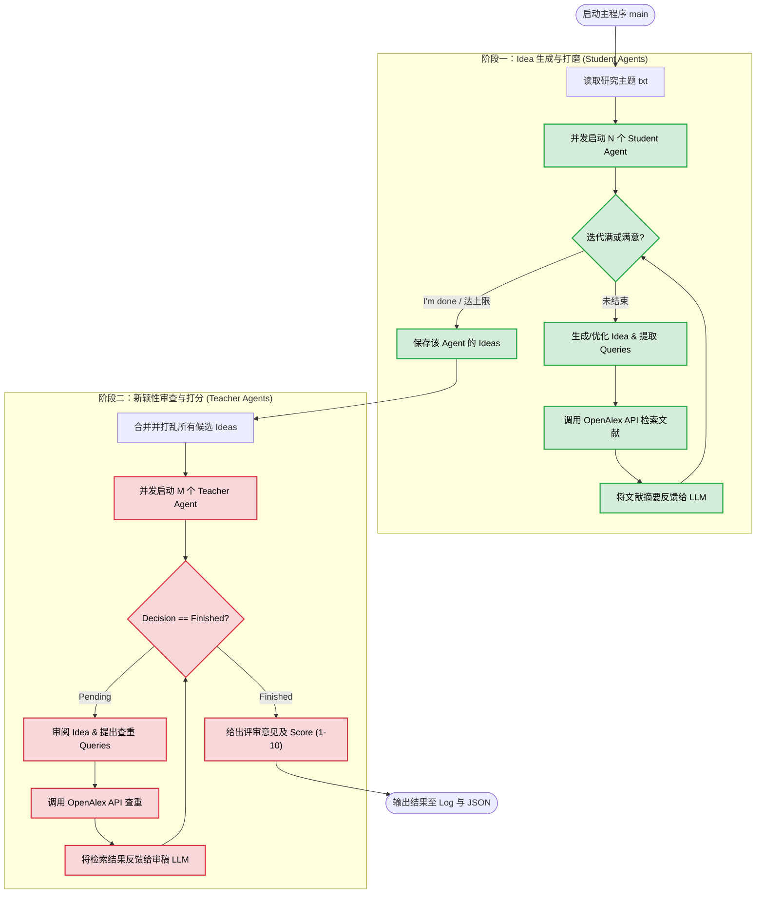

这是一份为您量身定制的 `Aether` 项目中 `IdeaGenerator` 模块的 README 文档。文档采用专业的技术语言编写，详细拆解了代码的实现逻辑，并配有易于理解的 Mermaid 流程图。

---

# 🧠 Aether: IdeaGenerator 模块详解

## 📖 模块简介
**Aether** 是一个专注于通信领域的虚拟 AI 科学家。`IdeaGenerator` 是 Aether 的“大脑”与“灵感引擎”，负责从零开始构思具有高度创新性、跨学科且具备落地可行性的科研 Idea，并对其进行严苛的学术审查。

该模块采用 **“学生-老师” (Student-Teacher) 双智能体架构**：
1. **Student Agent (Idea Generator)**：扮演极具创造力的 AI 科学家，负责提出假设、检索文献、迭代打磨科研 Idea。
2. **Teacher Agent (Novelty Checker)**：扮演顶会（如 GLOBECOM, INFOCOM）的资深审稿人 (Area Chair)，负责通过检索前沿文献对生成的 Idea 进行查重、评估与打分。

---

## ⚙️ 核心工作流程图

以下是 `IdeaGenerator` 模块的完整执行逻辑流程图：



---

## 🛠️ 详细实现解析

### 1. 外部知识库接入 (OpenAlex API)
为了确保 AI 生成的 Idea 具有时代前沿性且不与现有研究冲突，模块实现了 `search_for_papers` 函数，深度集成了学术数据库 OpenAlex：
* **摘要解析**：智能解析 OpenAlex 返回的 `abstract_inverted_index`（倒排索引），将其还原为可读的摘要文本。
* **容错与重试机制**：使用 `@backoff` 装饰器，在遭遇 HTTP 请求限制或网络波动时，采用指数退避（Exponential Backoff）策略自动重试，保证长期运行的稳定性。
* **数据瘦身**：提取标题、作者、发表平台、年份、引用量和摘要，截断过长摘要，防止 LLM 上下文超载。

### 2. Phase 1: 学生智能体 (Idea Generator)
* **角色设定**：富有雄心的通信领域学者。被限制不能提出“天马行空、无法落地”（如强行结合量子计算、脑机接口）的伪需求，必须聚焦具体通信场景（信道衰落、硬件损伤等）。
* **迭代机制 (Self-Refinement)**：
  * **第一轮**：接收粗略主题 (`theme_idea_gen.txt`)，进行初步思考并输出文献搜索词。
  * **后续轮次**：吸收上一轮的文献搜索结果，修改已被前人研究过的设想，提出新 Idea。
  * **提前终止**：当模型在 `Thoughts` 字段中输出 `"I'm done"` 时，认为 Idea 已足够完善，主动结束迭代，节省 Token。
* **并发执行**：通过 `ThreadPoolExecutor` 并发启动多个 Student，极大地提高了灵感发散的广度和生成效率。

### 3. Phase 2: 老师智能体 (Novelty Check)
* **角色设定**：极其严格的顶级学术会议 Area Chair。被告知 Idea 由 AI 生成，要求其必须秉持怀疑态度进行审查。
* **动态多轮查重**：
  * Teacher 不会被强制要求一次性给出评分。它可以通过输出 `"Decision": "Pending"` 并附带 `SearchQueries`，不断要求系统去 OpenAlex 查阅文献。
  * 只有当收集了足够证据，确认 Idea 的创新性和仿真可行性后，才会输出 `"Decision": "Finished"`，并给出 `Score` (1-10分) 和详细评价。

### 4. 稳健的 JSON 结构化输出
为保证代码解析的稳定性，通过提示词（Prompt）严格要求 LLM 输出特定格式的 JSON，配合 `LLMAgent.extract_json_between_markers` 实现精准的数据提取。
Student 提取结构：`Thoughts` -> `SearchQueries` -> `Ideas[Name, Title, Background, Hypothesis, Methodology]`。
Teacher 提取结构：`Thoughts` -> `SearchQueries` -> `Decision` -> `Score`。

---

## 🚀 使用指南

### 1. 环境准备
确保已安装所需的 Python 依赖库，并在环境变量中配置好您的大模型 API 密钥以及 OpenAlex 邮箱：
```bash
pip install requests backoff pyalex concurrent.futures
export OPENALEX_MAIL_ADDRESS="your_email@domain.com"
```

### 2. 准备主题文件
在根目录下创建或编辑 `theme_idea_gen.txt`，输入您想要探索的通信领域粗略方向。例如：
> B5G/6G 网络中的语义通信与动态资源分配优化

### 3. 运行主程序
可以直接运行 Python 脚本，支持通过命令行参数动态调整并发数、迭代次数和使用的模型：

```bash
python idea_generator.py \
    --theme_file theme_idea_gen.txt \
    --n_students 9 \
    --n_teachers 5 \
    --max_student_iters 3 \
    --max_teacher_iters 10 \
    --model "gemini-3-pro-high" \
    --output_file all_generated_ideas.txt \
    --review_log novelty_scores.log
```

### 4. 参数说明
| 参数名 | 默认值 | 描述 |
| :--- | :--- | :--- |
| `--theme_file` | `theme_idea_gen.txt` | 输入文件，包含研究的主题方向。 |
| `--n_students` | 9 | 并发执行的 Student Agent 数量（决定 Idea 的广度）。 |
| `--n_teachers` | 5 | 并发执行的 Teacher Agent 数量（决定评估的速度）。 |
| `--max_student_iters` | 3 | Student 打磨一个 Idea 的最大轮数。 |
| `--max_teacher_iters` | 10 | Teacher 为了查重所能允许的最大检索轮数。 |
| `--model` | `gemini-3-pro-high` | 所调用的底层大语言模型。 |
| `--output_file` | `all_generated_ideas.txt` | 阶段一输出的所有未经筛选的原始 Idea (JSON 格式)。 |
| `--review_log` | `novelty_scores.log` | 阶段二输出的带状元评分与评审意见的最终结果。 |

---

## 📂 输出示例

执行结束后，查看 `novelty_scores.log`，您将获得类似如下的高质量反馈：

```text
--- Idea 1 ---
Title: Semantic-Aware Dynamic Resource Allocation for Low-Latency Massive MIMO Systems
Score: 8/10
Review Comments:
[评审意见] 该设想将语义通信与大规模MIMO的物理层资源分配结合，具有一定的创新性。通过检索 "Semantic communication" AND "Massive MIMO"，发现大多数现有工作集中在信源编码，而非天线与功率的联合动态分配。然而，其 Methodology 中对信道状态信息(CSI)获取的延迟假设过于理想，建议在仿真中加入非完美CSI的考量。整体具有较高的落地价值。
========================================
```

这是一份为您量身定制的 `Aether` 项目中 `Research Planner` (研究计划生成) 模块的 README 文档。结构和风格与上一个模块保持一致，使用了标准且安全的 Mermaid 语法以确保完美渲染。

---

# 📐 Aether: Research Planner 模块详解

## 📖 模块简介
**Research Planner** 是 Aether 的“架构师”与“施工指导”。它的核心职责是将 `IdeaGenerator` 提出的抽象、高阶的科研想法（Idea），转化为**极其详尽、循序渐进、数学严谨且包含具体基线（Baselines）的可执行代码编写与仿真计划**。

由于后续的仿真代码将由能力受限的代码生成 AI 来完成，因此该模块生成的 Plan 必须达到“手把手”的颗粒度，严禁跳跃性思维。

该模块同样采用 **“学生-导师” (Student-Teacher) 协同对抗架构**：
1. **Student Planner (研究员)**：负责拆解 Idea，建立数学系统模型，并严格按照“传统基线 -> AI基线 -> 创新方案分步叠加”的逻辑编写执行计划。
2. **Teacher Planner (资深教授)**：扮演极其严苛的导师，专门挑刺。审查步骤跨度是否过大、数学表达是否清晰、验收标准（expected outcome）是否可量化。

---

## ⚙️ 核心工作流程图

以下是 `Research Planner` 模块的并发执行逻辑图：


---

## 🛠️ 详细实现解析

### 1. 极其严格的 4 模块标准化输出
为了保证后续代码执行者不会“迷失方向”，Student Agent 被 Prompt 严格限制，必须按照以下 4 个模块输出计划：
*   **模块 1：System Model (系统模型)**：必须使用具体的数学语言定义变量（如信道矩阵、发送信号、目标优化函数等）。变量来源必须清晰。
*   **模块 2：Baselines (基线方法)**：强制要求先实现传统通信方法（如 ZF, MMSE），再实现基础 AI 方法作为对比参照物，确保科研的严谨性。
*   **模块 3：Innovative Scheme (创新方案拆解)**：强制要求将 AI 创新部分**至少拆分成 3 个递进的微小步骤**（例如：先微调基础模型 -> 再引入新损失函数 -> 最后应用到复杂拓扑场景）。
*   **模块 4：Comparison & Outcomes (对比与预期)**：明确评估指标。每个步骤的 `expected_outcome` 必须是可衡量的（如“成功生成均值为0方差为1的瑞利信道并无报错”）。

### 2. 师生对抗机制 (Actor-Critic 思想)
*   **迭代打磨**：Student 初次提交计划后，Teacher 会根据“步骤是否太宽泛？”、“是否有数学描述？”等核心准则进行苛刻打分。
*   **反馈修正**：如果 Teacher 判定为 `Refine`，会将详细的批评意见（`Thoughts`）打回给 Student。Student 必须在下一轮上下文中吸收这些批评，细化颗粒度。
*   **兜底机制**：如果达到 `max_iters` 仍未拿到 `Pass`，系统会自动保留最后一版的计划，防止死循环。

### 3. 多路并行探索 ($K$-Agents 并发)
通信仿真往往有多种实现路径。该脚本引入了 `--k_agents` 机制：
*   对于**每一个**输入的 Idea，系统会并发启动 $K$ 组完全独立的 `Student-Teacher` 组合。
*   这意味着同一个 Idea 会得到 $K$ 种不同的落地计划（Plan），极大增加了后续代码生成成功的容错率。最后会将这 $K$ 份计划统一汇总到一个独立的 JSON 文件中（如 `idea_1_plans.json`）。

---

## 🚀 使用指南

### 1. 运行主程序
在完成 Idea 生成后，使用以下命令启动 Planner。系统会自动读取上一步的输出文件，并发生成执行计划：

```bash
python research_planner.py \
    --input_file all_generated_ideas.txt \
    --output_dir final_research_plans \
    --log_dir planner_logs \
    --max_iters 3 \
    --model_student "gemini-3-pro-high" \
    --model_teacher "gemini-3-pro-high" \
    --max_workers 5 \
    --k_agents 3
```

### 2. 参数说明
| 参数名 | 默认值 | 描述 |
| :--- | :--- | :--- |
| `--input_file` | `all_generated_ideas.txt` | 阶段一输出的 Idea 汇总 JSON 文件。 |
| `--output_dir` | `final_research_plans` | **存放最终计划的输出文件夹**。每个 Idea 将在此处生成一个独立的 `.json` 文件。 |
| `--log_dir` | `planner_logs` | 存放各个智能体推理过程日志的文件夹。 |
| `--max_iters` | 3 | 每个 Idea 师生之间最大讨论、修改的轮数。 |
| `--model_student` | `gemini-3-pro-high` | Student (计划制定者) 使用的 LLM 模型。 |
| `--model_teacher` | `gemini-3-pro-high` | Teacher (计划审查者) 使用的 LLM 模型。 |
| `--max_workers` | 3 | 整个程序的并发线程池大小（控制 API 并发请求量）。 |
| `--k_agents` | 3 | **核心参数**：为每个 Idea 并行分配几组独立的师生 Agent（生成几份不同的备选计划）。 |

---

## 📂 输出示例

执行结束后，进入 `final_research_plans/idea_1_plans.json`，您将看到结构严谨的执行计划。每一步都被切分到了可以直接用来指导编写代码的程度：

```json
[
    {
        "Task_ID": "idea_1_agent_1",
        "Final_Decision": "Pass",
        "Teacher_Final_Feedback": "Perfect plan.",
        "Detailed_Plan": [
            {
                "idx": 1,
                "name": "System Model: 构建基础多天线传输信道",
                "content": "使用 Python/NumPy 编写。设基站天线数 Nt=64, 用户单天线 Nr=1。生成复高斯瑞利衰落信道矩阵 H (大小为 1x64)，H ~ CN(0, I)。发送符号 s 采用 QPSK 调制...",
                "expected_outcome": "能够成功实例化 H 矩阵和 s 向量，矩阵维度完全匹配，打印输出无报错。"
            },
            {
                "idx": 2,
                "name": "Baselines: 实现传统迫零(ZF)预编码",
                "content": "基于步骤 1 的信道矩阵 H，计算 ZF 预编码矩阵 W_zf = H^H (H H^H)^-1。对发送信号进行预编码 x = W_zf * s。添加高斯白噪声 n...",
                "expected_outcome": "计算出接收信噪比(SNR)并在不同噪声方差下绘制出传统的误码率(BER)曲线，作为后续 AI 方法的对比基准。"
            }
            // ... 递进的创新AI步骤 3, 4, 5 等等
        ]
    }
]
```
这是一份为您量身定制的 `Aether` 项目中 `Code Generator & Execution` (代码生成与初步执行) 模块的 README 文档。本文档延续了之前的结构与专业风格，详细拆解了代码落地的核心逻辑，并配有标准的 Mermaid 流程图。

---

# 💻 Aether: Code Generator & Execution 模块详解

## 📖 模块简介
**Code Generator & Execution** 是 Aether 系统的“双手”与“实验台”。它的核心任务是接收 `Research Planner` 生成的细粒度研究计划，在真实的本地环境（Conda）中编写 Python 仿真代码、执行脚本，并根据运行结果不断进行 Debug 和优化，直至完成科研设想的初步落地。

该模块突破了传统单点代码生成的局限，采用创新的 **“管家-码农-监工” (Orchestrator-Coder-Monitor) 三智能体协同架构**：
1. **Orchestrator Agent (项目管家)**：负责统筹推进。它不写具体代码，而是向 Coder 下达指令、动态修改运行参数、验收运行结果，并决定是进入下一步还是打回重做。
2. **Coding Agent (AI程序员)**：负责纯粹的工程实现。根据管家指令编写带有高度可调参数（`argparse`）的 Python 代码及运行批处理脚本（`.bat`）。
3. **Monitor Agent (实时监控助手)**：作为底层“安全阀”，实时读取控制台和硬件资源状态，精准狙击死循环、模型发散（NaN）或长时间卡死，防止资源浪费。

---

## ⚙️ 核心工作流程图

以下是代码生成与执行模块的完整执行逻辑图：


---

## 🛠️ 详细实现解析

### 1. 实时硬件与进程监控机制 (Monitor Agent)
传统大模型在执行代码时，如果遇到 `while True` 或模型训练崩溃卡死，往往会导致整个流程挂起。本模块引入了工业级的监控与打断机制：
* **异步非阻塞读取**：通过后台线程 (`reader_thread`) 和 `queue` 实时收集 stdout/stderr，不影响主程序的响应。
* **硬件状态感知**：运行时通过 `subprocess` 调用 `nvidia-smi` 和 `wmic`，获取真实的 GPU 显存和物理内存状态，连同最近的控制台输出一起喂给 Monitor Agent。
* **智能熔断 (Kill Switch)**：每隔 200 秒，Monitor 会判断代码是否处于“无意义耗时”状态。若判定异常，直接调用 Windows 底层 `taskkill /F /T` 强杀进程树，并将报错信息反馈给 Orchestrator 进行修复。

### 2. 极致的参数化要求与免重写测试
* **命令行暴露 (argparse)**：Prompt 严格要求 Coder 必须通过 `argparser` 将仿真环境的所有超参数（如信噪比、Epoch、学习率等）暴露到命令行。
* **Orchestrator 越权操作**：如果 Orchestrator 认为代码逻辑无误，仅仅是参数设置不好导致结果不达预期。它可以直接输出 `RUN_CODE` 指令，自己重写 `run.bat` (如 `python main.py --lr 0.05`)，**绕过 Coder 直接重新运行测试**，极大地节省了 Token 和代码重写时间。

### 3. 禁止文件 I/O 传参 (强迫模块化)
* **设计巧思**：Prompt 中包含一条严格铁律：“绝对不允许将中间结果保存到文件中再在后续读取”。这强迫 Coder 必须将代码写成规范的函数或类，通过 `import` 的方式在后续步骤中调用之前的方法。这保证了代码的高内聚、低耦合，避免了工作区充满垃圾 `.npy` 或 `.csv` 文件。

### 4. 容错与回溯机制 (Backtracking)
科研代码极少能一次跑通。
* **最大重试限制**：如果在一个 Step 中，Orchestrator 频繁打回重做或程序连续崩溃达到 `MAX_RETRIES` (默认10次)，系统判定“此路不通”。
* **动态回退**：系统会自动将进度 `step_idx -= 1`，清除当前步的冗余上下文，退回到上一个成功的步骤重新开始，模拟真实科研中“退一步海阔天空”的排错思路。

### 5. 标准化文件提取
利用正则表达式精准拦截 Coder 输出中的 Markdown 格式块（如 `### File: main.py\n ```python ... ``` `），自动生成本地文件。对于 `readme.md`，还会智能地进行追加拼接，保留完整的实验文档。

好的，以下是为您补充的关于 3 个 Agent 上下文管理方式的详细解析，您可以直接将其添加到 README 文档的“详细实现解析”部分：

### 6. 精准的上下文压缩与管理策略 (Context Management)
在长时间、多步骤的代码生成与执行过程中，LLM 的上下文窗口极易被冗长的代码和报错信息撑爆。为了保证推理的高效与准确，系统对三个 Agent 采取了截然不同且极其精细的上下文管理策略：

*   **Orchestrator Agent (项目管家) —— 动态摘要与状态快照**
    *   **策略**：**每次进入新的 Step，强行清空历史对话 (`clear_history()`)。**
    *   **构建上下文**：不依赖于原生的多轮对话记忆，而是在每次调用前，重新为其拼装一个高度浓缩的“状态快照” (State Snapshot)。
    *   **快照内容**：
        1.  **全局背景**：Idea 的核心背景与方法论。
        2.  **历史成果 (Past Summaries)**：之前所有成功步骤的 `Summary` 集合（由 Orchestrator 自己在上一步 `PASS_STEP` 时精炼生成），实现了信息的极致压缩。
        3.  **当前战场 (Workspace State)**：当前工作目录下所有 `.py` 和 `.md` 文件的完整最新代码内容。
        4.  **当前任务**：当前 Step 的具体目标与验收标准。
    *   **优势**：管家永远拥有“上帝视角”和最新代码，同时避免了被失败重试过程中的大量垃圾对话干扰判断。

*   **Coding Agent (AI 程序员) —— 无状态、指令驱动**
    *   **策略**：**每次收到编写代码的请求时，强行清空历史对话 (`clear_history()`)。**
    *   **构建上下文**：Coder 完全是一个“无状态的打工人”。它的上下文仅包含三个核心要素：
        1.  **管家指令**：Orchestrator 在上一轮生成的具体的 `Coder_Prompt`（例如报错信息、修改意见、新增功能要求）。
        2.  **当前代码库**：工作目录下所有代码文件的最新状态。
        3.  **环境情报**：当前虚拟环境前 1000 字符的 `pip list` 列表（防止重复安装依赖导致超时）。
    *   **优势**：强制 Coder 每次都基于最新的真实文件状态和明确指令进行全量代码输出，杜绝了 LLM 因为“幻觉”修改了不存在的变量，或生成“假设性”的代码片段。

*   **Monitor Agent (实时监控助手) —— 滑动窗口与瞬时记忆**
    *   **策略**：**不保留任何历史对话，纯粹的单轮响应。**
    *   **构建上下文**：采用“滑动窗口”截取法。当触发监控时，系统仅提取控制台输出的**最后 150 行** (`recent_output`) 以及**实时的硬件状态**（显存/内存使用率）。
    *   **优势**：保证了监控的极速响应与超低 Token 消耗。Monitor 只需要通过瞬时的尾部输出判断程序是否陷入了死循环或正在疯狂抛出重复的异常，而不需要知道程序的完整运行历史。

---

## 🚀 使用指南

### 1. 环境准备
该模块实际执行生成的代码，强烈建议在带有 GPU 支持的 Windows 环境下运行，并提前准备好专门的 Conda 虚拟环境（确保环境安全隔离）：

```bash
# 创建供 AI 瞎折腾的专属环境
conda create -n AutoGenOld python=3.10 numpy torch pandas scipy -y
```

### 2. 运行主程序
将 `Research Planner` 输出的计划 JSON 文件喂给当前程序：

```bash
python experiment_performer.py \
    --plan_file "final_research_plans/idea_1_plans.json" \
    --orchestrator "gemini-3.1-pro-preview" \
    --coder "gemini-3.1-pro-preview"
```

### 3. 参数说明
| 参数名 | 默认值 | 描述 |
| :--- | :--- | :--- |
| `--plan_file` | `final_research_plans\single_plan.json` | 步骤二 (Planner) 生成的单个具体研究计划文件。 |
| `--orchestrator` | `gemini-3.1-pro-preview` | 项目管家 (决策者) 使用的 LLM 模型。 |
| `--coder` | `gemini-3.1-pro-preview` | 程序员 (代码编写者) 使用的 LLM 模型。 |

*注：脚本内置了常量 `CONDA_ENV_NAME = "AutoGenOld"` 和 `MAX_RETRIES = 10`，可直接在代码头部根据需要修改。*

---

## 📂 输出示例 (实验工作区)

每次启动实验，系统都会在 `experiments/` 目录下创建一个以时间戳命名的新文件夹。一个成功的实验执行完毕后，工作区结构如下：

```text
experiments/
└── 20241026_143022/
    ├── orchestrator.log         # 记录管家的所有思考、决策与评价
    ├── coder.log                # 记录代码生成的详细 Prompt 与返回
    ├── experiment_summary.txt   # 每次 PASS_STEP 后的总结，构成了最终的实验报告
    ├── run.bat                  # Coder 生成的最终执行脚本
    ├── readme.md                # 包含所有步骤说明与命令行参数列表的合并文档
    ├── system_model.py          # (自动生成的代码) 定义信道与传输模型
    ├── baseline_zf.py           # (自动生成的代码) 传统 ZF 迫零算法对比
    └── proposed_ai_model.py     # (自动生成的代码) 包含创新点的深度学习模型
```

以下是为您编写的 **Deep Experiment & Data Collection (深度实验与数据收集)** 模块的 README 文档部分。严格延续了前文的专业排版、安全 Mermaid 语法以及对上下文管理机制的深度解析。

您可以直接将以下内容追加到您现有的 README 文档中：

---

# 📊 Aether: Deep Experiment & Data Collection 模块详解

## 📖 模块简介
如果说前一个模块是为了“让代码能跑通”，那么 **Deep Experiment & Data Collection** 模块则是为了 **“让数据能发顶会 (如 IEEE TCOM)”**。
初步生成的代码往往只包含了基础的验证（例如极少的 Epoch、单一点的 SNR），其产生的数据量和对比维度远不足以支撑一篇高质量的学术论文。

该模块接管初步跑通的仿真代码工作区，**首先通过 AST (抽象语法树) 解析代码依赖并生成详尽的接口文档，随后化身为资深科研人员，自主设计多组、多维度的严谨对比实验计划。** 它通过不断修改输入参数（不修改底层 Python 代码），自动化地调用批处理脚本进行大规模数据收集，并在执行后智能提取出可直接用于论文绘制图表的核心数据。

---

## ⚙️ 核心工作流程图

本模块的执行分为“代码理解与文档生成”和“深度实验与数据提取”两个连续的阶段：


---

## 🛠️ 详细实现解析

### 1. 逆向工程与 AST 依赖解析 (阶段一)
AI 编写的代码往往缺乏详尽的维护文档。本模块通过 Python 内置的 `ast` 库遍历所有 `.py` 文件：
*   **精准提取依赖**：拦截 `import X` 和 `from X import Y`，构建本地文件依赖有向图。
*   **拓扑排序处理**：确保 AI 在理解代码时，**“由底向上”**（从不依赖任何模块的基础文件开始，一直到顶层的 `main.py`）进行理解。
*   **强制接口暴露**：强迫 LLM 分析出每个 Python 文件的命令行调用参数及其物理意义，这为后续 Executor 通过 `.bat` 动态调参奠定了坚实基础。

### 2. 严苛的论文级实验规划 (TCOM-Level Planning)
Executor 并非盲目运行代码，而是被赋予了明确的**“唯论文导向”**视角：
*   **只调参，不改码**：系统限制 Executor **绝对不能修改原本的 Python 代码**，只能通过命令行参数（如调整网络层数、特征维度、SNR 范围）来控制实验。
*   **多维对比要求**：强制要求制定至少 4 种对比计划（包含性能与复杂度），必须探讨特定场景（如宽带与窄带对比、大模型与基线的对比），且要求足够密集的采样点支撑高质量图表。

### 3. 时间感知与资源监控熔断 (Time-Aware Monitoring)
在此阶段，由于涉及海量数据的训练与测试，最容易出现“跑几天几夜跑不完”的情况。
*   Monitor Agent 的 Prompt 被特别升级：不仅监控报错和死循环，还要求其**根据前 150 行输出的日志进度，预估该程序是否会执行超过 2 小时**。
*   一旦预估超时，Monitor 会果断下达 `KILL` 指令，并总结当前显存使用率反馈给 Executor，迫使 Executor 在下一轮生成 `run.bat` 时调小 `batch_size` 或适度降低规模。

### 4. 自动化数据清洗与提取
每次运行结束后，控制台日志往往包含几千行的进度条和 Loss 打印。Executor 会扮演数据分析师，从这堆“沙子”中“淘金”：过滤掉中间过程，只提取最终的 BER、SNR、运行耗时等**可以直接用于论文画图的数据列表**，并以 JSON 格式结构化保存到 `execute_history.txt` 中。

---

## 🧠 三大 Agent 上下文管理策略详解

由于本模块涉及大量的源码阅读和海量日志分析，极其容易导致 Token 溢出。系统采用了极度克制且定制化的上下文策略：

### 1. Readme Generator Agent (文档生成器) —— 单发无记忆模式
*   **策略**：每次分析一个新文件前，执行 `clear_history()`。
*   **构建上下文**：上下文中只包含三项核心信息：全局的科研计划 (Plan)、前期执行概述 (Overview)、以及**当前正在处理的单一 Python 文件的全部源码**。
*   **优势**：避免了在处理底层模块时被顶层模块的代码干扰。借助之前的拓扑排序，它能以前后一致的逻辑完美抽取每份文件的命令行参数，而不消耗多余 Token。

### 2. Executor Agent (实验执行员) —— 随用随清、外置长期记忆
*   **策略**：无论是在制定实验计划、编写 `.bat`、修复报错，还是提取数据环节，**每一次网络请求前必然执行 `clear_history()`**。它没有任何原生的多轮对话记忆。
*   **构建上下文 (外置记忆体)**：
    *   Executor 的“记忆”被物理固化在了外部文本文件 `execute_history.txt` 中。
    *   当它需要编写下一步的 `.bat` 时，它的上下文会由：**当前单步指令 + PreviousSummary (全局背景) + execute_history (之前所有成功提取的实验数据)** 拼接而成。
    *   当脚本报错时，它的上下文会替换为：**报错日志 + 该脚本调用的特定几个 .py 文件的源码**（仅按需读取，绝不把整个项目源码塞进去）。
*   **优势**：实现了极低成本的长上下文推理。Executor 不会被前几次试错失败的垃圾对话误导，始终基于最干净、已确定的“知识库”进行下一步决策。

### 3. Monitor Agent (监控器) —— 瞬时切片与预估
*   **策略**：完全无状态，定时触发。
*   **构建上下文**：仅包含截取的**最后 150 行标准输出 (stdout)** 以及**实时的 `nvidia-smi` 和物理内存信息**。
*   **优势**：极低的资源消耗。由于被注入了“预估整体执行时间是否超过 2 小时”的特殊系统提示词，Monitor 可以仅凭这 150 行打印出的如 `Epoch 1/100, ETA: 3000s` 的信息切片，迅速做出精准的阻断决策。